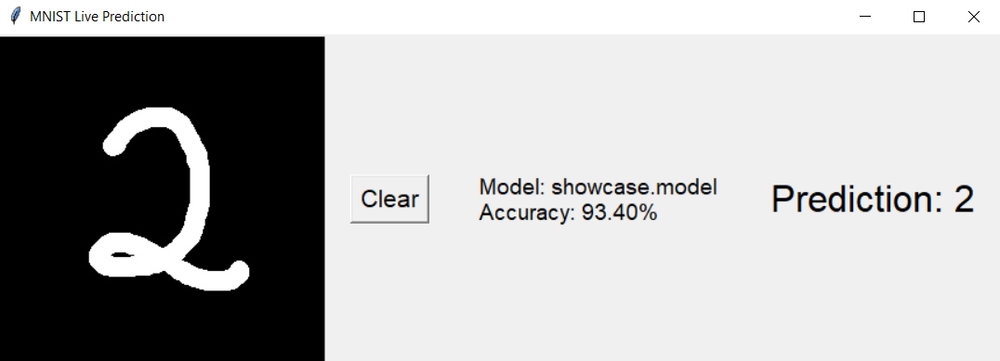

# python-ml-framework

This is a **small framework implemented in pure Python** for training perceptron-like ML models

## Installation & Run

First, clone the repo to your computer

```shell
git clone https://github.com/BesserwisserErsterKlasse/python-ml-framework
```

Change into the project directory

```shell
cd yttg-server
```

Open [`VS Code`](https://code.visualstudio.com/), choose a [Python 3.14](http://python.org/downloads/) kernel, and press `Run All` button

You will be prompted to choose an existing model or train a new one. Input `0` to choose the showcase model and wait for a few seconds for a drawer to start

## Drawer



The drawing interface allows you to input a handwritten digit for real-time prediction

- Move your cursor over the black input area and hold the left mouse button to draw

- The model processes the drawing every 0.5 seconds, updating the prediction continuously

- Click **Clear** to reset the canvas.

**Note:** The model only recognizes digits 0-9

## License

python-ml-framework is a free, open-source software distributed under the [MIT License](LICENSE.txt)
